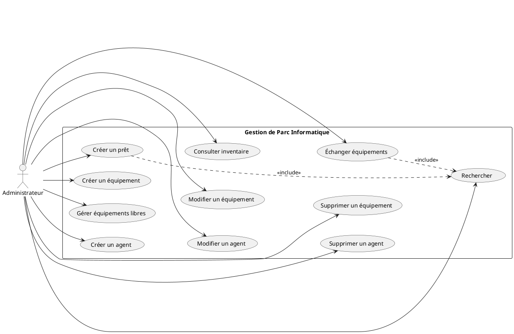

# Diagramme de cas d'utilisation - GestionParc

## Description
Ce diagramme montre les fonctionnalités principales du système et qui peut les utiliser.

## Acteurs
- **Administrateur** : Utilise toutes les fonctionnalités
- **Agent** : Utilise l'inventaire (en lecture seule dans cette version)

## Cas d'utilisation principaux

### Gestion des Agents
- Créer un agent
- Modifier un agent
- Supprimer un agent
- Rechercher un agent

### Gestion des Équipements
- Créer un équipement
- Modifier un équipement
- Supprimer un équipement
- Rechercher un équipement
- Gérer les équipements libres/rendus DSEM

### Gestion des Prêts et Échanges
- Créer un prêt
- Consulter les équipements en prêt
- Échanger des équipements entre agents

### Consultation
- Consulter l'inventaire complet
- Voir les détails d'un agent
- Voir les détails d'un équipement

## Code PlantUML (à copier dans Draw.io ou PlantUML)

## Version simplifiée pour Draw.io

Si PlantUML ne fonctionne pas, voici comment le dessiner manuellement :

1. **Acteur** (bonhomme) : Administrateur
2. **Rectangle englobant** : "Gestion de Parc Informatique"
3. **Ellipses** (cas d'utilisation) :
   - Créer un agent
   - Modifier un agent
   - Supprimer un agent
   - Créer un équipement
   - Modifier un équipement
   - Supprimer un équipement
   - Créer un prêt
   - Échanger équipements
   - Consulter inventaire
   - Rechercher
4. **Flèches** : De l'Administrateur vers chaque ellipse
