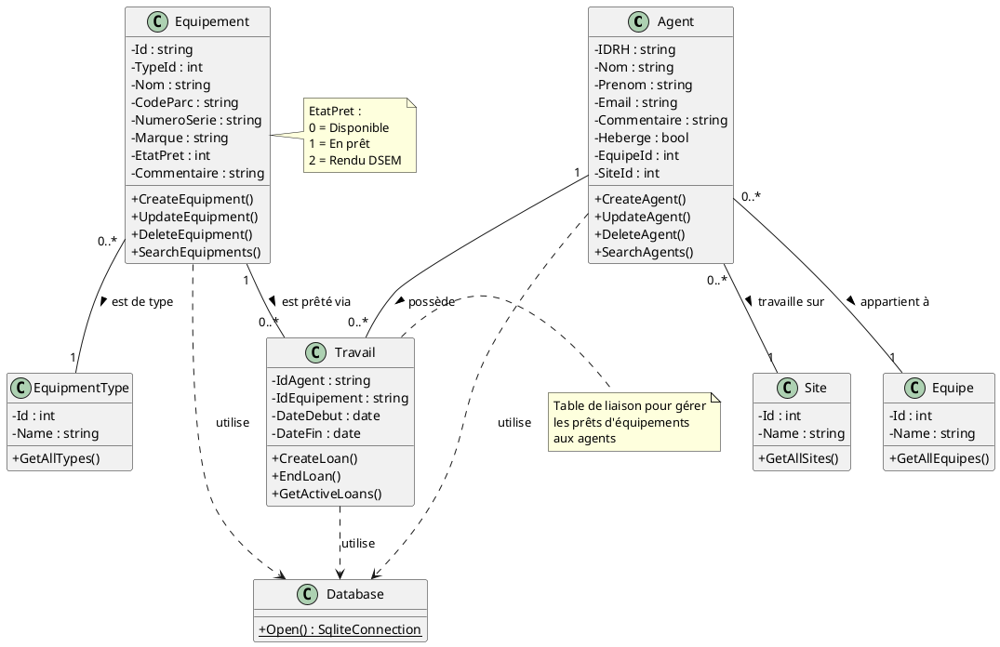

# Diagramme de classes - GestionParc

## Description
Ce diagramme montre les principales classes du système et leurs relations.

## Classes principales

### Agent
- **Attributs** :
  - IDRH : string
  - Nom : string
  - Prenom : string
  - Email : string
  - Equipe : string
  - Heberge : bool
  - Site : string
  - Commentaire : string

- **Méthodes** :
  - CreateAgent()
  - UpdateAgent()
  - DeleteAgent()
  - SearchAgent()

### Equipement
- **Attributs** :
  - Id : string
  - TypeId : int
  - Nom : string
  - CodeParc : string
  - NumeroSerie : string
  - Marque : string
  - EtatPret : int (0=disponible, 1=prêté, 2=DSEM)
  - Commentaire : string

- **Méthodes** :
  - CreateEquipment()
  - UpdateEquipment()
  - DeleteEquipment()
  - SearchEquipment()

### EquipmentType
- **Attributs** :
  - Id : int
  - Name : string

### Site
- **Attributs** :
  - Id : int
  - Name : string

### Equipe
- **Attributs** :
  - Id : int
  - Name : string

### Travail (table de liaison Agent-Equipement)
- **Attributs** :
  - IdAgent : string
  - IdEquipement : string
  - DateDebut : date
  - DateFin : date (nullable)

## Code PlantUML



## Version simplifiée pour dessin manuel

### Rectangles (classes) à dessiner :

**Agent**
```
┌─────────────────┐
│     Agent       │
├─────────────────┤
│ - IDRH          │
│ - Nom           │
│ - Prenom        │
│ - Email         │
│ - EquipeId      │
│ - SiteId        │
├─────────────────┤
│ + CreateAgent() │
│ + UpdateAgent() │
│ + DeleteAgent() │
└─────────────────┘
```

**Equipement**
```
┌──────────────────┐
│   Equipement     │
├──────────────────┤
│ - Id             │
│ - TypeId         │
│ - Nom            │
│ - CodeParc       │
│ - EtatPret       │
├──────────────────┤
│ + Create()       │
│ + Update()       │
│ + Delete()       │
└──────────────────┘
```

**Travail**
```
┌──────────────────┐
│     Travail      │
├──────────────────┤
│ - IdAgent        │
│ - IdEquipement   │
│ - DateDebut      │
│ - DateFin        │
├──────────────────┤
│ + CreateLoan()   │
└──────────────────┘
```

### Relations (flèches) :

- **Agent → Travail** : ligne avec "1" côté Agent et "0..*" côté Travail
- **Equipement → Travail** : ligne avec "1" côté Equipement et "0..*" côté Travail
- **Equipement → EquipmentType** : ligne avec "0..*" côté Equipement et "1" côté EquipmentType
- **Agent → Equipe** : ligne avec "0..*" côté Agent et "1" côté Equipe
- **Agent → Site** : ligne avec "0..*" côté Agent et "1" côté Site

### Légende :
- Ligne pleine = Association
- "1" = Un seul
- "0..*" = Zéro ou plusieurs
