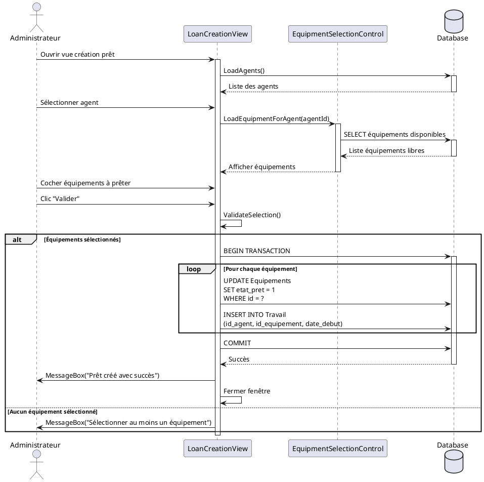
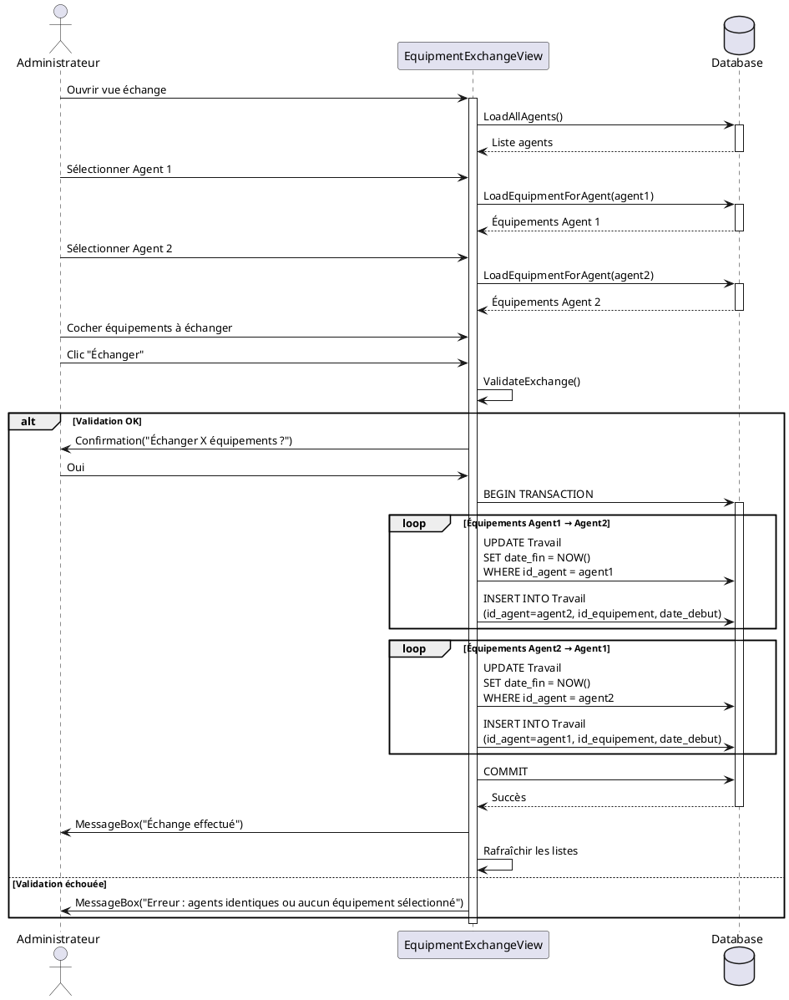
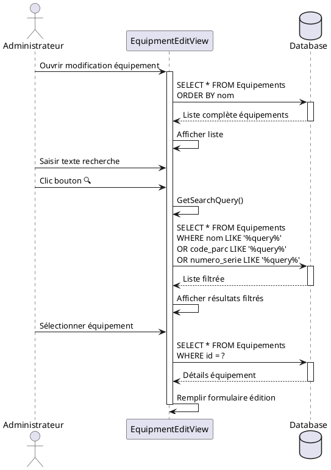

# Diagramme de séquence - GestionParc

## Description
Ces diagrammes montrent les interactions entre les objets lors de l'exécution d'une fonctionnalité.

---

## Scénario 1 : Création d'un prêt d'équipement

### Description
L'administrateur crée un nouveau prêt en associant un agent à un équipement.

### Acteurs
- Administrateur
- LoanCreationView
- EquipmentSelectionControl
- Database

### Code PlantUML



---

## Scénario 2 : Échange d'équipements entre agents

### Description
L'administrateur échange des équipements entre deux agents.

### Code PlantUML



---

## Scénario 3 : Recherche d'un équipement

### Description
L'administrateur recherche un équipement par mot-clé.

### Code PlantUML



---

## Version simplifiée pour dessin manuel

### Scénario : Création d'un prêt

```
Administrateur    LoanCreationView    Database
     |                  |                 |
     |---Ouvrir-------->|                 |
     |                  |--LoadAgents()-->|
     |                  |<--Liste---------|
     |                  |                 |
     |--Sélect. agent-->|                 |
     |                  |--GetEquipments->|
     |                  |<--Liste---------|
     |                  |                 |
     |--Cocher équip.-->|                 |
     |--Clic Valider--->|                 |
     |                  |--BEGIN TRANS--->|
     |                  |--UPDATE-------->|
     |                  |--INSERT-------->|
     |                  |--COMMIT-------->|
     |                  |<--Succès--------|
     |<--Message OK-----|                 |
     |                  |                 |
```

### Éléments à dessiner :

1. **Acteurs/Objets** (rectangles en haut) :
   - Administrateur (bonhomme)
   - LoanCreationView
   - Database

2. **Lignes de vie** (lignes verticales pointillées)

3. **Messages** (flèches horizontales avec texte) :
   - Flèche pleine = appel de méthode
   - Flèche pointillée = retour

4. **Barres d'activation** (rectangles fins sur les lignes de vie)
   - Montrent quand un objet est actif

---

## Conseils pour la présentation

### À expliquer au jury :

1. **Diagramme de séquence du prêt** :
   - "Voici comment se déroule la création d'un prêt étape par étape"
   - "On charge d'abord les agents disponibles"
   - "Puis les équipements libres de l'agent sélectionné"
   - "Enfin, on utilise une transaction pour garantir la cohérence"

2. **Points techniques à mettre en avant** :
   - Utilisation de **transactions SQL** (BEGIN/COMMIT)
   - Validation des données avant enregistrement
   - Gestion des erreurs (try/catch)
   - Rafraîchissement de l'interface après modification

3. **Questions probables du jury** :
   - "Que se passe-t-il si la base échoue ?"
     → "Le COMMIT échoue, les modifications sont annulées (ROLLBACK automatique)"
   
   - "Pourquoi une transaction ?"
     → "Pour garantir que tous les équipements soient prêtés ensemble ou aucun"
   
   - "Comment gérez-vous 2 utilisateurs simultanés ?"
     → "SQLite verrouille la base pendant l'écriture, le 2e attend"

---

## Fichiers à créer pour ta présentation

1. **Cas d'utilisation** : Montre QUOI (les fonctionnalités)
2. **Diagramme de classes** : Montre LES OBJETS (structure)
3. **Diagramme de séquence** : Montre COMMENT (le déroulement)

Ces 3 diagrammes couvrent les attentes du jury ! 🎯
